# Benutzerdokumentation
###### für die App
### Deutsch für dich
##### Version 1.0
###### Erstellungsdatum 21.02.2017
###### Version vom 22.02.2017

Erstellt von: Jan Göbel, Dominik Klumpp, Philip Lenzen, Katja Ludwig, Ralph Reithmeier

### 1 Erste Schritte

Nach dem Herunterladen der App muss auf neueren Android-Versionen die Erlaubnis gegeben werden, das Mikrofon zu benutzten.

Bei der ersten Benutzung ist es außerdem nötig, mit einer bestehenden Internetverbingung Audiodateien zum Üben herunterzuladen. Falls keine WLAN-Verbindung besteht, wird bei einem Downloadvorgang vorher gewarnt. Die Größe einer Audiodatei schwankt je nach Länge etwa um 10MB.

### 2 Aktivitäten

Für die Erklärungen in diesem Abschnitt werden Screenshots der Android-Version verwendet. Auf iOS können kleinere Unterscheide auftreten, die nicht erwähnt werden. Sollte es einen wichtigen Unterschied geben, wird dies erwähnt.

#### 2.1 Verwalten von Übungsmaterial

Sofern noch keine Dateien heruntergeladen wurden, wird die App mit folgender Seite gestartet:

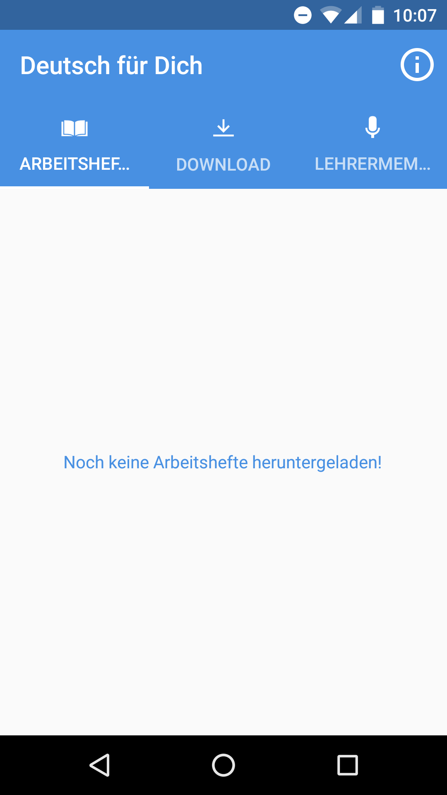

Der Nutzer befindet sich aktuell in der Ansicht "Arbeitshefte", wo alle lokal gespeicherten Arbeitshefte angezeigt werden. Hier kann er jetzt erkennen, dass auf seinem Gerät noch keine Dateien lokal gespeichert sind.

##### 2.1.1 Ganzes Arbeitsheft herunterladen

Um ein gesamtes Arbeitsheft mit allen zugehörigen Seiten herunterzuladen, wechselt der Benutzer in die Ansicht "Download".

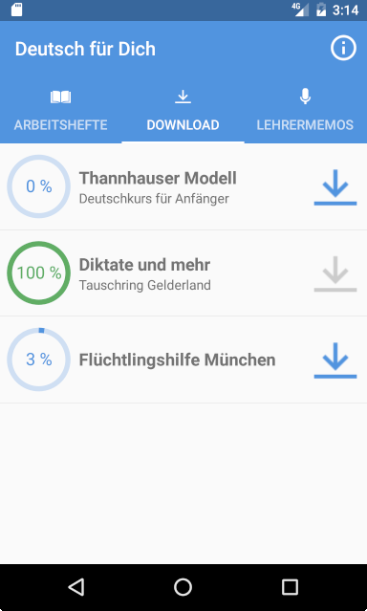

Sofern bei einem Arbeitsheft noch Seiten fehlen, ist der Download-Knopf blau und verfügbar. Durch einen Klick auf ihn wird der Download gestartet. Der Fortschritt des Downloads wird durch das inkrementieren der Prozentzahl angezeigt. Sobald das Arbeitsheft komplett heruntergeladen ist, wird der zugehörige Kreis grün und der Download-Knopf ausgegraut, wie im Screenshot oben bei "Diktate und mehr" zu sehen ist.

##### 2.1.2 Einzelne Seiten herunterladen

Möchte der Nutzer nur einzelne Seiten herunterladen, wählt er in der Übersicht der Arbeitshefte (siehe Screenshot unter 2.1.1) ein Arbeitsheft aus. Die App zeigt nun alle verfügbaren Seiten an:

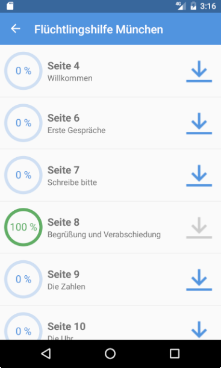

Auch hier wird wieder der blaue Download-Knopf benutzt, um eine Seite herunterzuladen. Während dem Downloadvorgang bekommt man auch hier den Forschritt über das Hochzählen der Prozentzahl angezeigt. Fertig heruntergeladene Seiten sind wieder mit einem grünen Kreis markiert.

Bei einem Wechsel zurück auf die Download-Übersichtsseite der Arbeitshefte sieht man nun eine kleinere Prozentzahl bei dem Arbeitsheft, bei dem man gerade die Seite heruntergeladen hat. Zu sehen ist dies im Screenshot unter 2.1.1 beim Arbeitsheft "Flüchtlingshilfe München"

##### 2.1.3 Übungsmaterial löschen

Es gibt die Möglichkeit, ganze Arbeitshefte zu löschen, aber auch nur einzelne Seiten. Um etwas zu löschen, wechselt man zuerst auf die Übersicht über alle lokalen Arbeitshefte:

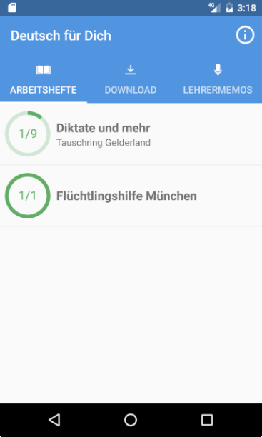

Möchte man ein ganzes Arbeitsheft löschen, hält man unter Android das Arbeitsheft lange gedrückt, bis im oberen rechten Eck eine Mülltonne erscheint. Durch einen Klick darauf wird das Arbeitsheft mitsamt allen Audiodateien vom Smartphone entfernt. Unter iOS muss der Nutzer, statt auf das Arbeitsheft lange zu drücken, die Tabellenzeile des Arbeitshefts nach links schieben. Auf der rechten Seite erscheint dann ein roter "Löschen"-Knopf, der die selbe Funktionalität besitzt wie die Mülltonne.

Um eine einzelne Seite zu löschen, wählt man das Arbeitsheft, zu dem diese Seite gehört, in der Übersichtsseite aus. Eine Übersicht über alle vorhandenen Seiten zu diesem Heft wird nun angezeigt:

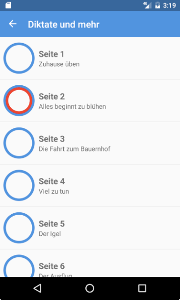

Der Löschvorgang funktioniert nun für einzelne Seiten genauso wie für ganze Arbeitshefte: unter Android durch gedrückt halten der Seite und Klick auf die Mülltonne, unter iOS durch das nach links wischen der Tabellenzeile und Auswahl des "Löschen"-Knopfs.

Eine Besonderheit existiert für alle Seiten, zu denen bereits Schülerspuren aufgenommen wurden. Hier zeigt die Android-App neben der Mülltonne noch ein durchgestrichenes Mikrofon an und die iOS-App einen weiteren Knopf mit der Aufschrift "Aufnahme löschen". Die Auswahl dieser Möglichkeit löscht die gerade hinterlegte Schülerspur zur ausgewählten Seite, behält aber die heruntergeladene Lehrerspur auf dem Gerät.

#### 2.2 Mit dem Übungsmaterial lernen

Sobald mindestens eine Seite heruntergeladen wurde und in der "Arbeitshefte"-Ansicht angezeigt wird, kann mit dem Üben begonnen werden.

##### 2.2.1 Seite bearbeiten

Der Benutzer wählt in der "Arbeitshefte"-Ansicht das Arbeitsheft und in der darauf folgend angezeigten Seitenübersicht die Seite aus, die er üben möchte. Er hat nun zwei Optionen: entweder er hört sich zunächst nur die Lehrerspur dazu an, oder er nimmt gleich seine eigene Stimme mit auf. Im ersten Fall wählt der Nutzer den blauen "Play"-Knopf:

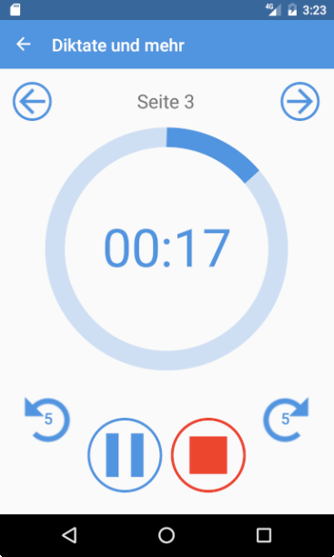

Je nach Fortschritt läuft der blaue Kreis voll und zeigt an, wie viel der Audiodatei bereits abgespielt wurde. Außerdem läuft die Zeit im Inneren des Kreises mit. Über den Vor- und Zurück-Knopf kann in der Aufnahme 5 Sekunden vor- bzw. zurück gesprungen werden. Mit Pause wird die Wiedergabe angehalten und kann zu einem beliebigen Zeitpunkt fortgesetzt werden. Der rote "Stopp"-Knopf setzt die Wiedergabe an den Anfang zurück und stellt wieder die Option zum Aufnehmem bereit.

Sobald der Nutzer bereit ist, kann eine Aufnahme gemacht werden. Hierzu wird nach der Auswahl einer Seite oder nach einem Klick auf den "Stopp"-Knopf der rote "Aufnehmen"-Knopf gewählt. Falls bereits eine Schülerspur existiert, warnt die App den Benutzer davor, dass diese  überschrieben wird. Jetzt spielt die App die Lehrerspur ab und nimmt gleichzeitig die Stimme des Benutzers auf.

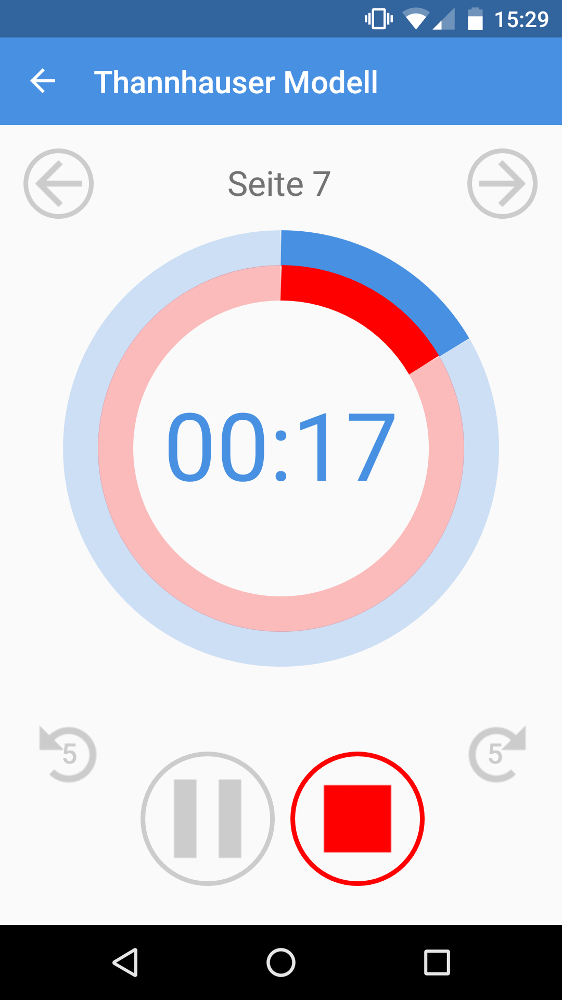

Die App zeigt durch das mitlaufen eines roten Kreises an, dass die Aufnahme aktiv ist. Die beste Qualität erhält man, wenn man Kopfhörer oder ein Headset benutzt. Möchte der Benutzer nicht bis zum Ende der Lehrerspur mitsprechen, kann er den "Stopp"-Knopf wählen. Die Aufnahme wird in diesem Fall trotzdem als Schülerspur gespeichert, deckt aber natürlich nicht den gesamten Zeitraum der Lehrerspur ab.

##### 2.2.2 Aufnahmen anhören

Hat der Benutzer eine Schülerspur aufgenommen, kann er diese anhören. Bei der Auswahl einer Seite mit Schülerspur passiert dies automatisch, wenn auf den "Play"-Knopf geklickt wird. Der rote Kreis zeigt wieder an, dass die Schülerspur mit abgespielt wird.

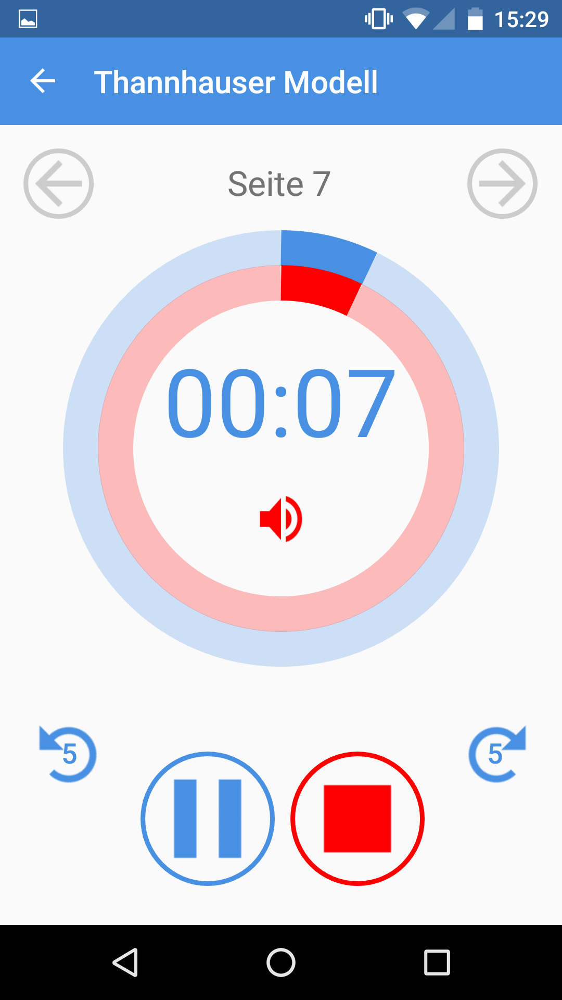

Auch hier gilt wieder: Über den Vor- und Zurück-Knopf kann in beiden Aufnahmen 5 Sekunden vor- bzw. zurück gesprungen werden. Mit Pause wird die Wiedergabe angehalten und kann zu einem beliebigen Zeitpunkt fortgesetzt werden. Der rote "Stopp"-Knopf setzt die Wiedergabe an den Anfang zurück.

Außerdem ist im Kreis ein roter Lautsprecher angebracht. mit ihm kann man die Schülerspur stumm schalten, wenn man nur die Lehrerspur hören möchte:

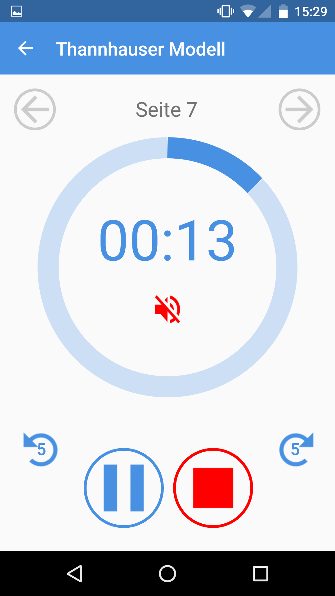

Der rote Kreis verschwindet in diesem Fall. Er erscheint wieder, sobald der Lautsprecher wieder angeklickt wird. Dann wird auch die Schülerspur wieder abgespielt.

**Hinweis:** In der Übersicht der lokal verfügbaren Seiten eines Arbeitshefts werden alle Seiten, zu denen bereits eine Schülerspur existiert, mit einem roten Kreis dargestellt. Somit kann der Nutzer sofort erkennen, welche Seiten er schon geübt hat, und welche noch nicht:

In der Übersicht der lokalen Arbeitshefte wird durch den grünen Kreis außerdem angezeigt, wie viele Seiten dieses Hefts bereits bearbeitet wurden. Die Angabe bezieht sich auf alle lokal verfügbaren Seiten.

Dadurch kann der Nutzer seinen Lernfortschritt auf einen Blick erfassen.

#### 2.3 Lehrermemos

Lehrermemos sind nützlich, wenn ein Schüler Probleme mit der Aussprache einzelner Begriffe oder Sätze hat. Der Sprachlehrer kann ihm während des Unterrichts ein Sprachmemo auf das Handy sprechen, das er sich dann zum Üben anhören kann und auch dazu sprechen.

##### 2.3.1 Lehrermemos aufnehmem

Es wird auf dem Smartphone des Schülers zur Ansicht "Lehrermemos" gewechselt. Durch die Auswahl des Plus-Buttons, der sich bei Android unten rechts, bei iOS in der Kopfzeile befindet, wird die Oberfläche für ein neues Lehrermemo geöffnet:

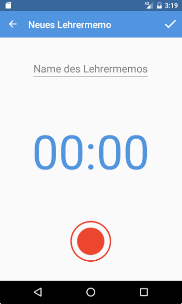

Mit dem Aufnahmeknopf kann die Aufnahme gestartet werden. Dabei läuft die Zeit mit:

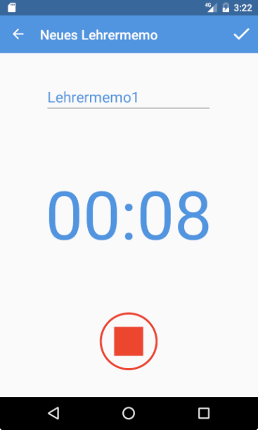

Mit dem "Stopp"-Knopf kann die Aufnahme nun gestoppt werden. Außerdem muss ein Name für das Memo festgelgt werden. Das neue Lehrermemo wird jetzt in der Übersicht angezeigt:

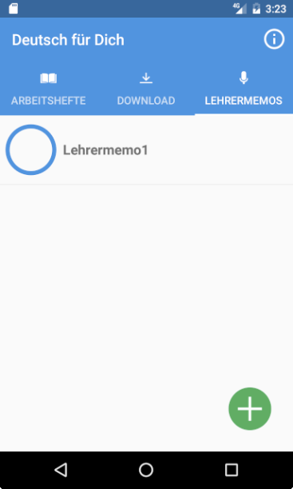

##### 2.3.2 Mit Lehrermemos üben

Mit Lehrermemos kann genauso geübt werden, wie mit Seiten von Arbeitsheften. Alles Wichtige hierzu wurde bereits in Abschnitt 2.2 beschrieben und kann dort nachgelesen werden. Wurde eine Lehrermemo bearbeitet, wird dies analog zu den Seiten wieder mit einem roten Kreis angezeigt:

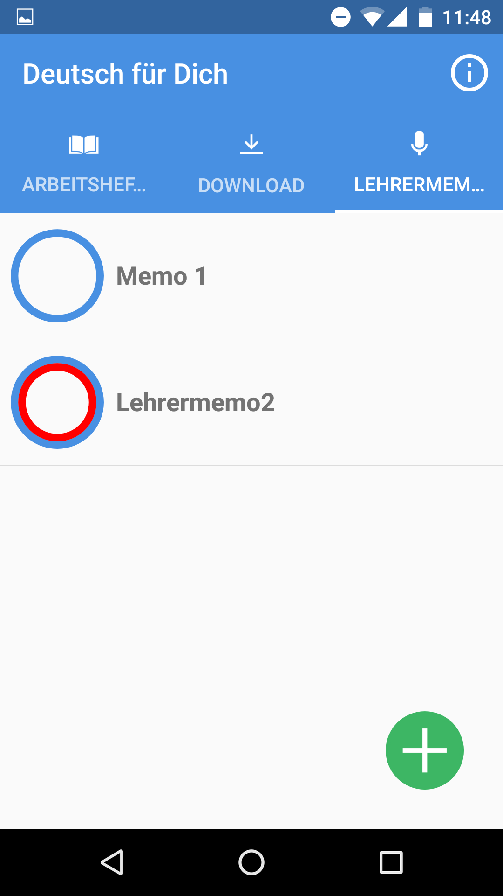

##### 2.3.3 Lehrermemos verwalten

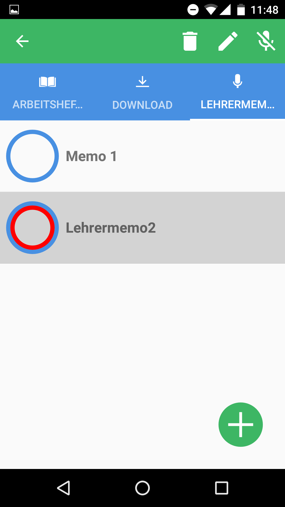

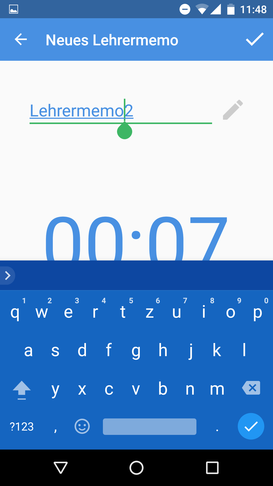
