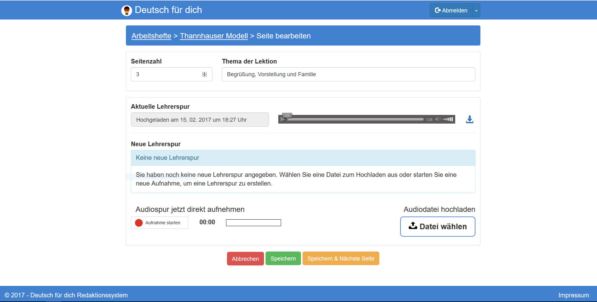

# Benutzerdokumentation
###### für das
### Redaktionssystem
##### Version 1.0
###### Erstellungsdatum 21.02.2017
###### Version vom 22.02.2017

Erstellt von: Jan Göbel, Dominik Klumpp, Philip Lenzen, Katja Ludwig, Ralph Reithmeier

### 1 Erste Schritte
Zur Benutzung des Redaktionssystems von "Deutsch für dich" wird ein Benutzerkonto mit Passwort benötigt. Es ist aktuell unter https://lingvo.azurewebsites.net/ zu finden. Dort wird man zunächst dazu aufgefordert, sich einzuloggen.

### 2 Aktivitäten
#### 2.1 Arbeitshefte verwalten

Folgende Abbildung zeigt die Übersicht über alle aktuell im Redaktionssystem vorhandenen Arbeitshefte.

In der Tabelle wird zusätzlich zu Titel und - falls vorhanden - Untertitel die vorhandene Anzahl an Seiten und das Datum der letzten Änderung an diesem Arbeitsheft angezeigt.

In der rechten Spalte werden über Icons Bearbeitungsmöglichkeiten bereitgestellt:
* Über den Stift kann man ein Arbeitsheft bearbeiten.
* Das Auge signalisiert, ob ein Arbeitsheft veröffentlicht ist (blaues offenes Auge) oder nicht (graues durchgestrichenes Auge). Zur Änderung des Status kann man auf das Symbol klicken. Veröffentlicht bedeutet, dass alle Seiten des betreffenden Workbooks von Sprachschülern heruntergeladen werden können.
* Die Mülltonne dient zum Löschen des gesamten Arbeitshefts. Vorsicht: Alle Seiten werden mit gelöscht und können nicht wiederhergestellt werden!

###### 2.1.1 Arbeitsheft erstellen

Soll ein neues Arbeitsheft hinzugefügt werden, kann der grüne Knopf "Neues Arbeitsheft" in der Kopfzeile der Tabelle benutzt werden. Nach der Auswahl erscheint folgende Maske:

Der Nutzer gibt nun den Titel ein, der sich von den Titeln der bisher existenten Arbeitshefte unterscheiden muss. Bei Bedarf kann auch ein Untertitel eingegeben werden, dies ist aber kein muss. Soll das Arbeitsheft angelegt werden, klickt der Nutzer auf Speichern, andernfalls auf Abbrechen.

###### 2.1.2 Arbeitsheft bearbeiten

Möchte der Redakteur ein Arbeitsheft bearbeiten, beispielsweise weil er sich im Namen vertippt hat, kann er das Stift-Symbol benutzen.

Der Redakteur kann jetzt Titel und Untertitel bearbeiten und anschließend speichern oder abbrechen. Diese Operation verändert nichts an den zugeordneten Seiten. Lediglich die Bezeichnung wird geändert.

**Hinweis:** Ein Klick auf "Arbeitshefte" in der Kopfzeile leitet ebenfalls zurück auf die Übersichtsseite.

#### 2.2 Seiten verwalten

Möchte man sich alle Seiten eines Anrbeitshefts anzeigen lassen, so klickt man in der Übersichtsseite der Arbeitshefte auf den Titel des gewünschten. Die nächste Abbildung zeigt, wie so eine Seitenübersicht aussehen kann.

Zu jeder Seite ist die Seitennummer und gegebenfalls eine Beschreibung in der Liste aufgeführt. Außerdem ist die Dauer der zugehörigen Audiodatei in Minuten angegeben. Vor jeder Seite ist ein großer Play-Knopf angebracht. Klickt man auf diesen, wird die aktuelle Audiodatei der Seite abgespielt.

Auch hier gibt es wieder drei Symbolknöpfe am Ende jeder Tabellenzeile:
* Der Stift dient dazu, die Seite zu bearbeiten. Neben Beschreibung und Seitenzahl kann auch eine neue Audiodatei hochgeladen werden.
* Mit einem Klick auf den Download-Knopf kann die aktuelle Audiodatei zur Seite auf den Rechner heruntergeladen werden, beispielsweise falls sie nachbearbeitet werden soll.
* Die Mülltonne dient wieder dem Löschen. Wird sie ausgewählt, werden alle Daten der Seite inklusive der Audiodatei gelöscht und können nicht wiederhergestellt werden.

###### 2.2.1 Seite erstellen

Eine neue Seite kann über den grünen "Neue Seite"-Knopf in der Kopfzeile erstellt werden. Es öffnet sich folgende Seite:

In den oberen Textfeldern gibt der Redakteur die Seitenzahl und das Thema der Seite ein, dem späteren Untertitel. Wichtig ist, dass die Seitenzahl bisher noch bei keiner anderen Seite aus dem selben Arbeitsheft existiern darf. Durch einen Informationstext wird angezeigt, dass bisher noch keine Lehrerspur ausgwählt wurde. Nun gibt es zwei Möglichkeiten, eine Audiodatei zur neuen Seite hinzuzufügen.

Hat man bereits eine fertige Audiodatei auf seinem Computer gespeichert, kann man auf der rechten Seite den "Datei wählen"-Knopf benutzen. Ein Auswahlfenster öffnet sich, wo man die richtige Datei wählt und bestätigt. Das Redaktionssystem gibt durch folgende Oberfläche Rückmeldung über das erfolgreiche Hochladen:

Der Name der hochgeladen Datei ist nun im Informationsfenster enthalten. Auf der rechten Seite kann man sich die Datei nochmals anhören.

Hat der Redakteur noch keine fertige Audiodatei, kann er hier eine neue aufnehmen. Dazu klickt er auf der linken Seite auf den "Aufnahme starten"-Knopf. Wichtig ist, dass man dem Browser vorher erlaubt hat, das Mikrofon zu benutzen, sonst funktioniert das Aufnehmen nicht. Läuft die Aufnahme, wird dies folgendermaßen angezeigt:

Der rote Text "Aufnahme läuft" signalisiert, dass gerade aufgenommen wird. Daneben wird die Zeit, die seit dem Beginn der Aufnahme vergangen ist, angezeigt. Außerdem kann man den aktuellen Pegelausschlag im Feld rechts der Zeit erkennen. Ist die Aufnahme fertig, wählt der Redakteur "Aufnahme beenden".

Nun zeigt der Informationstext an, dass eine Aufnahme die aktuelle Lehrerspur darstellt. Auch hier kann der Redakteur sich die Aufnahme nochmals anhören oder auch mit Hilfe des Download-Knopfs auf den Rechner herunterladen, falls er sie noch extern bearbeiten möchte.

Hat der Redakteur sich für eine Audiodatei entschieden, klickt er entweder auf "Speichern" und landet wieder in der Seitenübersicht des Arbeitshefts, oder auf "Speichern & Nächste Seite", falls er gleich mit dem Anlegen der nächsten Seite weitermachen möchte.

###### 2.2.2 Seite bearbeiten

Durch einen Klick auf das Stiftsymbol in der Seitenübersicht kann wie in der folgenden Abbildung gezeigt eine Seite bearbeitet werden.

Der Redakteur kann Seitenzahl und Beschreibung ändern, aber auch eine neue Audiodatei auswählen. Welche Möglichkeiten es hier gibt, wurde bereits in Abschnitt 2.2.1 beschrieben und kann dort nachgelesen werden. Auch hier darf die Seitenzahl noch nicht an eine bereits dem selben Arbeitsheft zugeordeten Seite vergeben sein.

**Hinweis:** Über einen Klick auf den Namen des Arbeitshefts in der Kopfzeile kann zur Übersicht über die Seiten gewechselt werden. Die Auswahl von "Arbeitshefte" in der Kopfzeile springt zurück zur Übersicht über alle verfügbaren Arbeitshefte.

#### 2.3 Nutzer verwalten

Einem Redakteur ist es möglich, neue Nutzer für das Redaktionssystem zu erstellen. In der Kopfzeile ganz oben befindet sich der "Abmelden"-Knopf. Neben ihm befindet sich ein kleiner Pfeil, der ein Dropdown-Menü öffnet mit der Option "Neuen Nutzer anlegen". Folgende Maske öffnet sich jetzt:

Man gibt den Nutzernamen, der noch nicht vergeben sein darf, ein und wählt ein Passwort, das in der nächsten Zeile nochmal korrekt wiederholt werden muss. Nach einem Klick auf "Speichern" ist der Nutzer gespeichert und kann seinen Namen und Passwort beim Login benutzen.
