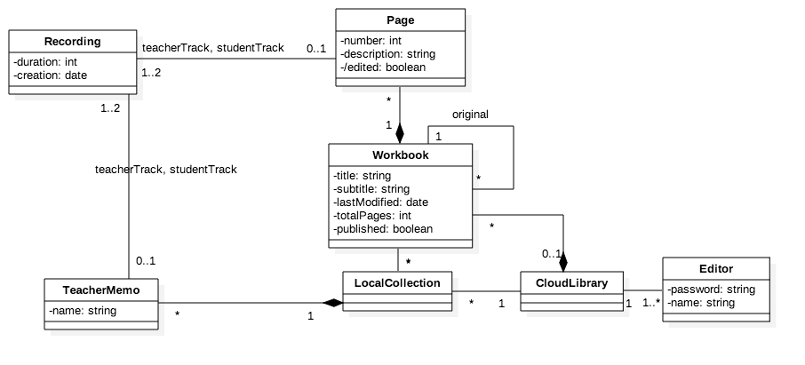
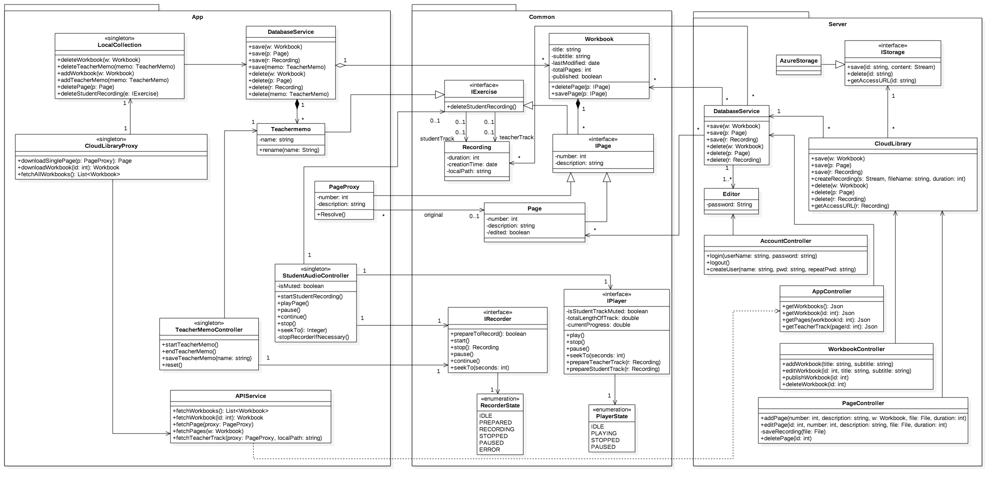
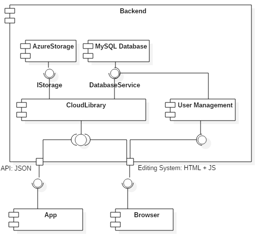

# Technical Documentation

### Deutsch für dich (Projekt Lingvo)
##### Version 1.0
###### Erstellungsdatum 21.02.2017
###### Version vom 22.02.2017

Erstellt von: Jan Göbel, Dominik Klumpp, Philip Lenzen, Katja Ludwig, Ralph Reithmeier

## Table of Contents

1. Introduction
2. Technologies & Project Management
3. Structure (Static View)
  * Domain Model
  * Design Model
  * Backend Structure
    * Interfaces
    * Internal Structure
  * App Structure
4. Dynamic View
5. Miscellaneous Documents
6. Non-Functional Characteristics

## Introduction
The purpose of our application is to support students, especially refugees, in
learning German following the *Thannhauser Modell*. The *Thannhauser Modell* focuses on the ability to communicate in common situations over grammatical peculiarities. Students read and listen to German texts and repeat them. They can record their own voice, allowing them to compare their own pronounciation with that of a native speaker, and to track their progress. Since many refugees only receive lessons in German once a week, the ability to practice at home is thus essential. Our application facilitates this by providing a mobile app that can play and record such exercises.

## Technologies & Project Management

The project is found on [github](https://github.com/maul-esel/swt-projekt), in the `Lingvo` directory. It consists of two main components: a server (or backend) and a mobile app. The server is based on the ASP.NET Core Framework and the .NET core runtime. Visual Studio 2017 RC, .NET Core 1.1 and the .NET Core SDK `1.0.0-preview4-004233` are necessary to build it. Other SDK versions will lead to build errors! Run `dotnet run` in `Lingvo/Solution/src/Backend` to start the server from the command line, or start it in Visual Studio. The mobile app is a Xamarin Forms App. Visual Studio 2017 RC is also necessary to build it, in addition to Xamarin Forms 2.3.3 (as specified in the nuget dependencies).

Third party libraries are managed as nuget packages, which must be restored before building the components. The following libraries and components were used:

* Backend
  * .NET
    * ASP.NET Core
    * ASP.NET Core Identity
    * EntityFramework Core
    * Azure Storage SDK
  * JS & CSS
    * Bootstrap
    * jQuery
    * [Recorder.js](https://github.com/mattdiamond/Recorderjs)
    * [volume-meter](https://github.com/cwilso/volume-meter)
  * MySQL 5.7
  * Azure Blob Storage
* App
  * Xamarin Forms
  * SQLite.NET PCL
  * Newtonsoft JSON (JSON.NET)

The backend was deployed as an Azure app service, currently available under <https://lingvo.azurewebsites.net>.

As discussed, github was used for project planning. Issues were opened on the github [issue tracker](https://github.com/maul-esel/swt-projekt/issues) and managed in a [github project](https://github.com/maul-esel/swt-projekt/projects/1). Changes before January 12 are documented in [the wiki](https:https://github.com/maul-esel/swt-projekt/wiki/Arbeits%C3%BCbersicht-bis-12.01.17). Code and document changes were managed via [pull requests](https://github.com/maul-esel/swt-projekt/pulls) and reviewed by other team members before being merged. [Travis CI](https://travis-ci.com/maul-esel/swt-projekt) was used to build all projects, run unit tests for the backend and deploy it to Azure.

## Structure (Static View)
The application follows the classical server-client architecture pattern: a server, or backend, manages a database containing a global library of workbooks and pages. Different clients read and manage this global library via a clearly defined HTTP interface.
First, an editor can access it via a web interface where he can create, edit, publish or delete workbooks. He can add pages to workbooks and create or upload recordings for these pages. Second, a mobile app is provided to refugees (or other students), allowing them to download these workbooks and pages via REST interface, listen to them, and record their own voice.

The backend is realized as an ASP.NET Core application built on the .NET Core framework and runtime. It is thus cross-platform compatible, since it uses no platform-specific functionality. The mobile app is a Xamarin Forms app and is thus also based on the .NET Framework. This allows us to build both an Android and an iOS app with very little platform-specific code.

### Domain Model
An analysis of the domain resulted in the following model:

The concepts seen in the diagram are explained in the [glossary](../Abgabe/Glossar.pdf).

### Design Model
The design model shows how these concepts are mapped to design classes and how data storage and physical distribution are implemented. The diagram can be found as /Abgabe/Designklassendiagramm.png in full size.

The `Common` package contains those entities from the domain model present in both the app and the backend. These classes are implemented once and used by both projects.

By abstracting from concrete implementations of audio playback, recording and file storage, these can be easily exchanged. In the case of audio playback and recording, this allows the necessary platform-specific implementations. Additionally, the underlying file storage can easily be replaced, e.g. by implementations for the local file system or other providers such as Google.

### Backend Structure

The following UML component diagram illustrates the basic structure of the backend:

#### Interfaces

It exposes two ports:

* a REST API that provides read-only JSON-formatted data to the mobile app
* and an Editing System that allows the user to manage the available workbooks and pages via a web interface.

These ports are implemented as a facade controller, split over multiple classes. Since the recommended architecture for ASP.NET Core is the Model-View-Controller pattern (MVC), this decision seems natural. The views are implemented in Razor, a scripting language that integrates C# with HTML. They are dynamically created on the server, hence very little client-side JavaScript is necessary. Specific view models exist for pages accepting user input. For display-only pages, the entity classes defined in the `Common` packages serve as models.

#### Internal Structure

A MySQL 5.7 database stores the workbooks and their pages as well as user information. Entity Framework Core is used as object-relational mapper, encapsulated in the `DatabaseService`. Recorded pages, i.e., MP3 files, are stored not in the database but in Azure Blob Storage. As discussed above, the `IStorage` interface abstracts from the concrete implementation. The `CloudLibrary` provides uniform handling of workbooks and pages across both data storages.

User management for the Editing System is implemented using the *ASP.NET Core Identity* framework. The relevant information is stored in the MySQL database as well.

As mentioned above, the conceptual facade controller is partitioned into 5 classes: `AppController` for the REST API, and `AccountController`, `WorkbookController`, `PageController` and `HomeController` for the Editing System. This separation has several reasons:

* Access Control: The need for authorization is specified as a class attribute. This makes it difficult to have methods for both the app and the Editing System in one class.
* Cohesion: Facade controllers typically have very low cohesion. For instance, fields relating to user management would be used by only three methods.
* Maintainability: By grouping the operations logically and reducing class size, maintainablity is improved.

### App Structure

Like the backend, the app also follows the MVC pattern. The most common pattern for Xamarin apps is ModelView-ViewModel (MVVM). However, MVC was chosen for two reasons:

* Use Case Controllers were already modeled as part of the business logic. Hence usage of MVVM would not have spared us the implementation of controllers.
* There are no view-specific states or properties in our app that are not already included in the model.

Almost all features are implemented in a shared project for both platforms. The only platform-specific classes are the audio player, the recorder, two custom views and WLAN-functionality.

#### Xamarin User Interface

The Mobile App is written in Xamarin Forms to allow the same design on all platforms. Therefore, it consists mainly of `Xamarin.Forms.Page` classes, while the main `NavigationPage` contains a `TabbedPage` as content. This gives the user a familiar experience because the page tabs are rendered in the default platform style. 
If a page contains a list, each item is displayed via a `ViewCell`, which is recycled if it's swiped out. Therefore, memory consumption is still quite small even with large item sets. 
In general, the data being displayed is obtained by one-way bindings directly on the model classes. 

As the user interface is written with Xamarin Forms, only very little platform-specific code is necessary. 
Beside platform-specific design styles, the progress views, which are present in most pages, and the image buttons (without background) are implemented on each platform and managed by custom renderers. 
Additionally, the audio player and recorder are not available in Xamarin Forms and therefore implemented on each platform. As they implement the interfaces `IPlayer` and `IRecorder`, the Xamarin Forms app is able to obtain instances by its `DependencyService`. The same applies to the `INetworkService` interface, which is responsible for determining the network state. 

#### Internal Structure

To request information about existing workbooks and pages or to actually download audio files, the `CloudLibraryProxy` provides methods which are hiding the actual web request logic executed by the `APIService`.
Whereas workbooks only contain meta-information, pages also have a (quite large) audio file which may cause high network traffic when syncing the available data on the server although the user doesn't want to download these pages. Therefore, the proxy-pattern offers the possibility to sync meta-data of pages and to download the actual audio file only if it's intended. The proxy class is called `PageProxy`, holding a reference to the actual `Page` object (which is not set until it's locally available). An interface `IPage` provides uniform handling of `PageProxy` and `Page` objects.

To create a new teachermemo, the `TeacherMemoController` offers functionality for recording and saving the audio file with a specific name.
Because teachermemos and pages both have a recording that can be practiced with, they extend the interface `IExercise`. This allows only one controlling class called `StudentAudioController` for practicing these exercises, which is responsible for playing and recording the audio files of the student.    

The information about locally available workbooks, pages, teachermemos and the corresponding recordings are stored in a SQLite .NET PCL Database, which is accessed by the `DatabaseService`. The actual audio files of recordings are stored in the platform-specific app folder. The access to this data is provided by the `LocalCollection` class, which is taking care of the information about all locally available workbooks, pages and teachermemos.

## Dynamic View

12 Use Cases document the usage scenarios for the Editing System and the mobile app. They can be found in [UseCases.pdf](../Abgabe/UseCases.pdf). Several scenarios from these Use Cases were analyzed further. The result can be seen in the System Sequence Diagrams found in [Systemsequenzdiagramme.pdf](../Abgabe/Systemsequenzdiagramme.pdf). The system operations were extracted and contracts ([Kontrakte.pdf](../Abgabe/Kontrakte.pdf)) were formulated.

## Miscellaneous Documents

The UI for app and the Editing System was mocked before development. The results can be found in [AppMocks.pdf](../Abgabe/AppMocks.pdf) and [RedaktionssystemMocks.pdf](../Abgabe/RedaktionssystemMocks.pdf). Usability was a key aspect in developing these designs. The final product closely resembles the original mocks.

## Non-Functional Characteristics

* ***Security:*** For the security of the backend, we rely on ASP.NET Core Identity and other ASP.NET core features as an established solution. Passwords are not stored as plaintext, but as salted hashes. All communication with the server is sent over HTTPS.
* ***Usability & Simplicity*** of app and Editing System were a key aspect of the design. Several alternatives were discussed, and feedback from the customer and usability experts was integrated.
* ***Maintainability:*** Unit tests exist in the backend for database access, the JSON REST API and the Editing System controllers. They are executed on Travis CI for each push to the github repository. The mobile app has unit tests for player and recorder functionality (on both platforms) as wells as UI tests for the core use cases. Since they require a device or a simulator, they are not executed on the CI.
